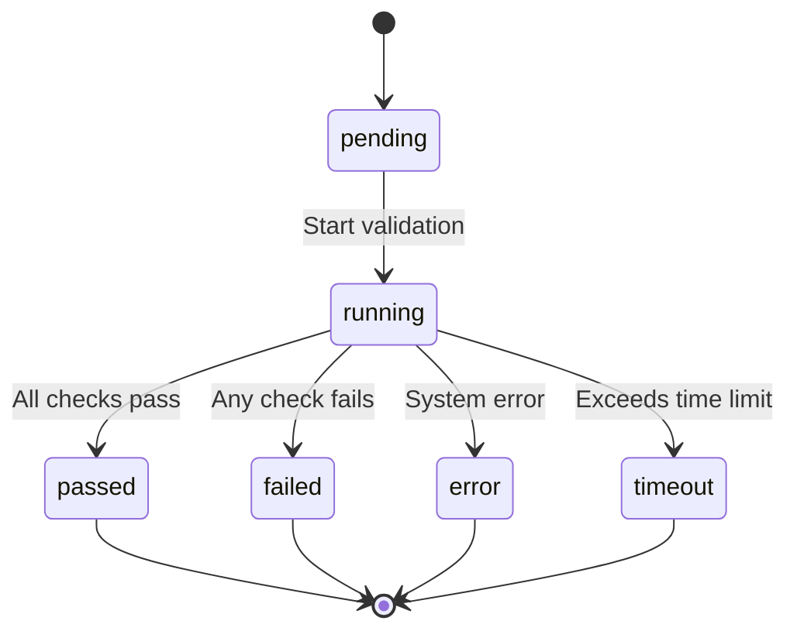
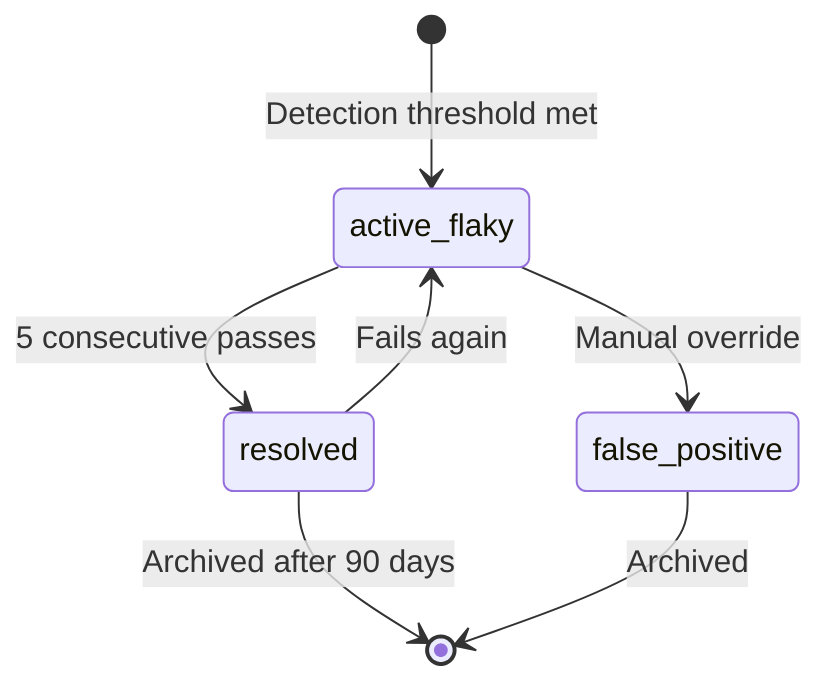

# Data Model: Testing System

**Feature**: Thorough Checking & Testing System
**Date**: 2025-12-17
**Status**: Complete

## Overview

This document defines all data entities, their relationships, state transitions, and validation rules for the testing system. All entities are designed to be serialized to JSON for storage and API communication.

---

## Core Entities

### ValidationRun

Represents a single execution of the complete validation pipeline.

**Fields**:
- `run_id` (string, UUID): Unique identifier for this validation run
- `timestamp` (datetime, ISO 8601): When the validation started
- `trigger_source` (enum): How the validation was triggered
  - Values: `manual`, `pre_commit`, `ci_cd`, `scheduled`
- `status` (enum): Current status of the validation
  - Values: `pending`, `running`, `passed`, `failed`, `error`, `timeout`
- `started_at` (datetime): When validation started
- `completed_at` (datetime, optional): When validation finished
- `duration_seconds` (float, optional): Total execution time
- `repository` (string): Repository being validated
- `branch` (string): Git branch name
- `commit_sha` (string): Git commit hash
- `user` (string, optional): User who triggered validation (for manual runs)

**Relationships**:
- Has one `CodeQualityReport`
- Has many `TestSuiteResult` (one per suite: unit/integration/e2e)
- Has one `DeploymentChecklist`

**State Transitions**:
```
pending → running → (passed | failed | error | timeout)
```

**Validation Rules**:
- `run_id` must be valid UUID
- `status` transitions must follow state machine
- `completed_at` must be after `started_at`
- `duration_seconds` must be positive

---

### CodeQualityReport

Contains aggregated results from static code analysis.

**Fields**:
- `report_id` (string, UUID): Unique identifier
- `run_id` (string, UUID): Foreign key to ValidationRun
- `timestamp` (datetime): When analysis completed
- `status` (enum): `passed`, `failed`, `warning`
- `linting` (object): Linting results
  - `violations` (array of Violation): Style issues found
  - `total_violations` (integer): Count of all violations
  - `error_count` (integer): Critical violations
  - `warning_count` (integer): Non-critical violations
- `complexity` (object): Complexity analysis results
  - `average_complexity` (float): Mean cyclomatic complexity
  - `max_complexity` (integer): Highest complexity in codebase
  - `high_complexity_functions` (array): Functions above threshold (>10)
- `coverage` (object): Test coverage metrics
  - `line_coverage_percent` (float): Line coverage percentage
  - `branch_coverage_percent` (float): Branch coverage percentage
  - `uncovered_lines` (integer): Count of uncovered lines
  - `by_test_type` (object): Coverage breakdown
    - `unit` (float): Unit test coverage
    - `integration` (float): Integration test coverage
    - `e2e` (float): E2E test coverage
- `security` (object): Security scan results
  - `vulnerabilities` (array of Vulnerability): Security issues found
  - `critical_count` (integer): Critical security issues
  - `high_count` (integer): High severity issues
  - `medium_count` (integer): Medium severity issues
  - `low_count` (integer): Low severity issues
- `summary` (object): Overall quality summary
  - `maintainability_index` (float, 0-100): Code maintainability score
  - `quality_gate_passed` (boolean): Whether quality standards met

**Nested Types**:

**Violation**:
- `file` (string): File path relative to repository root
- `line` (integer): Line number where violation occurs
- `column` (integer, optional): Column number
- `rule` (string): Linting rule identifier (e.g., `E501`)
- `severity` (enum): `error`, `warning`, `info`
- `message` (string): Human-readable violation description

**Vulnerability**:
- `package` (string): Affected package name
- `version` (string): Vulnerable version
- `severity` (enum): `critical`, `high`, `medium`, `low`
- `cve_id` (string, optional): CVE identifier
- `description` (string): Vulnerability description
- `fixed_version` (string, optional): Version that fixes the issue

**Validation Rules**:
- All percentage values must be 0-100
- Complexity values must be non-negative
- Coverage by test type must sum to overall coverage
- Violation line numbers must be positive

---

### TestSuiteResult

Captures outcomes from executing a specific test suite (unit, integration, or E2E).

**Fields**:
- `result_id` (string, UUID): Unique identifier
- `run_id` (string, UUID): Foreign key to ValidationRun
- `suite_type` (enum): Type of test suite
  - Values: `unit`, `integration`, `e2e`
- `status` (enum): Overall suite status
  - Values: `passed`, `failed`, `error`, `skipped`
- `started_at` (datetime): When suite execution started
- `completed_at` (datetime): When suite execution finished
- `duration_seconds` (float): Suite execution time
- `total_tests` (integer): Total number of tests in suite
- `passed_count` (integer): Number of passing tests
- `failed_count` (integer): Number of failing tests
- `skipped_count` (integer): Number of skipped tests
- `error_count` (integer): Number of tests with errors
- `test_cases` (array of TestCaseResult): Individual test results
- `flaky_tests_detected` (array of string): Test IDs identified as flaky
- `coverage_contribution` (float, 0-100): Coverage added by this suite

**Nested Type - TestCaseResult**:
- `test_id` (string): Unique test identifier (fully qualified test name)
- `test_name` (string): Human-readable test name
- `status` (enum): `passed`, `failed`, `error`, `skipped`
- `duration_seconds` (float): Individual test execution time
- `error_message` (string, optional): Error message if failed
- `stack_trace` (string, optional): Full stack trace if failed
- `assertions` (integer): Number of assertions in test
- `retries` (integer): Number of retries (for flaky test detection)

**Relationships**:
- Belongs to one `ValidationRun`
- Contains many `TestCaseResult` (inline)
- References `FlakyTestRecord` for detected flaky tests

**Validation Rules**:
- `total_tests` = `passed_count` + `failed_count` + `skipped_count` + `error_count`
- `duration_seconds` must be positive
- `completed_at` must be after `started_at`
- Test IDs must be unique within suite

---

### TestCase

Represents an individual test with execution history for flaky test detection.

**Fields**:
- `test_id` (string): Unique test identifier (fully qualified name)
- `test_name` (string): Human-readable test name
- `test_type` (enum): `unit`, `integration`, `e2e`
- `file_path` (string): Test file location
- `target_functionality` (string): What feature/module the test validates
- `execution_history` (array of ExecutionRecord): Last N executions (N=10)
- `flakiness_score` (float, 0-1): Probability of flakiness (1 - pass_rate)
- `is_flaky` (boolean): Whether currently identified as flaky
- `average_duration_seconds` (float): Mean execution time over history
- `last_execution` (datetime): Timestamp of most recent execution
- `created_at` (datetime): When test was first recorded
- `last_modified` (datetime): When test code was last changed

**Nested Type - ExecutionRecord**:
- `run_id` (string, UUID): Reference to ValidationRun
- `timestamp` (datetime): When test executed
- `status` (enum): `passed`, `failed`, `error`, `skipped`
- `duration_seconds` (float): Execution time
- `commit_sha` (string): Commit where test executed

**Validation Rules**:
- Execution history limited to last 10 runs
- `flakiness_score` must be 0-1
- `average_duration_seconds` must be positive
- `last_execution` must be >= `created_at`

---

### DeploymentChecklist

Collection of pre-deployment validation checks and their results.

**Fields**:
- `checklist_id` (string, UUID): Unique identifier
- `run_id` (string, UUID): Foreign key to ValidationRun
- `timestamp` (datetime): When deployment validation ran
- `status` (enum): `passed`, `failed`, `warning`
- `configuration` (object): Configuration validation results
  - `status` (enum): `passed`, `failed`, `warning`
  - `required_variables` (array of ConfigCheck): Env var validation
  - `secrets_exposure_risks` (array of SecretRisk): Hardcoded secret detection
  - `schema_validation` (object): JSON schema validation results
- `dependencies` (object): Dependency check results
  - `status` (enum): `passed`, `failed`, `warning`
  - `conflicts` (array of DependencyConflict): Version conflicts
  - `vulnerabilities` (array of Vulnerability): Security vulnerabilities
  - `outdated_packages` (array of OutdatedPackage): Packages needing updates
- `compatibility` (object): Environment compatibility results
  - `status` (enum): `passed`, `failed`, `warning`
  - `resource_checks` (array of ResourceCheck): CPU/memory requirements
  - `platform_compatibility` (array of PlatformCheck): OS/runtime checks
  - `service_availability` (array of ServiceCheck): External service checks

**Nested Types**:

**ConfigCheck**:
- `variable_name` (string): Environment variable name
- `is_present` (boolean): Whether variable is set
- `is_valid` (boolean): Whether value passes validation
- `error_message` (string, optional): Validation error if any

**SecretRisk**:
- `file` (string): File containing potential secret
- `line` (integer): Line number
- `secret_type` (enum): `api_key`, `password`, `token`, `certificate`
- `severity` (enum): `critical`, `high`, `medium`
- `matched_pattern` (string): Pattern that triggered detection

**DependencyConflict**:
- `package` (string): Package name
- `required_version` (string): Version required by dependent
- `installed_version` (string): Currently installed version
- `conflicting_dependent` (string): Which package has conflicting requirement

**OutdatedPackage**:
- `package` (string): Package name
- `current_version` (string): Installed version
- `latest_version` (string): Latest available version
- `security_update` (boolean): Whether update fixes security issues

**ResourceCheck**:
- `resource_type` (enum): `cpu`, `memory`, `disk`, `network`
- `required` (string): Required resource (e.g., "4 cores", "8GB RAM")
- `available` (string): Available resource in environment
- `sufficient` (boolean): Whether requirements met

**PlatformCheck**:
- `check_type` (enum): `os`, `runtime`, `architecture`
- `required` (string): Required platform (e.g., "Linux", "Python 3.11+")
- `actual` (string): Detected platform
- `compatible` (boolean): Whether compatible

**ServiceCheck**:
- `service_name` (string): External service name (e.g., "database", "redis")
- `endpoint` (string): Service endpoint/URL
- `is_available` (boolean): Whether service is reachable
- `response_time_ms` (float, optional): Ping response time

**Validation Rules**:
- At least one check type (configuration, dependencies, compatibility) must be present
- All nested status fields must aggregate to parent status
- Resource checks must have valid units
- Service endpoints must be valid URLs or connection strings

---

### FlakyTestRecord

Tracks tests identified as flaky with statistical confidence data.

**Fields**:
- `record_id` (string, UUID): Unique identifier
- `test_id` (string): Reference to TestCase
- `detected_at` (datetime): When flakiness was first detected
- `last_flake_at` (datetime): Most recent flaky execution
- `confidence` (float, 0-1): Statistical confidence in flakiness (e.g., 0.95)
- `pass_rate` (float, 0-1): Proportion of passing executions
- `sample_size` (integer): Number of executions analyzed (typically 10)
- `consecutive_passes` (integer): Consecutive passes since last failure
- `status` (enum): Flaky test status
  - Values: `active_flaky`, `resolved`, `false_positive`
- `execution_pattern` (array of boolean): Last N execution results (true=pass, false=fail)
- `failure_modes` (array of FailureMode): Distinct ways test fails
- `investigation_notes` (string, optional): Developer notes on flakiness cause

**Nested Type - FailureMode**:
- `error_signature` (string): Hash of error message/stack trace
- `frequency` (float, 0-1): Proportion of failures with this signature
- `sample_error` (string): Example error message

**State Transitions**:
```
active_flaky → resolved (after 5 consecutive passes)
active_flaky → false_positive (manual override)
resolved → active_flaky (if fails again)
```

**Validation Rules**:
- `confidence` must be 0-1
- `pass_rate` must be 0-1
- `sample_size` must be >= 10 for statistical validity
- `consecutive_passes` must be non-negative
- Sum of failure mode frequencies should be ~1.0
- `last_flake_at` must be >= `detected_at`

---

## Entity Relationships

```
ValidationRun (1)
├── CodeQualityReport (1)
│   ├── Violations (N)
│   └── Vulnerabilities (N)
├── TestSuiteResult (3: unit, integration, e2e)
│   ├── TestCaseResult (N, inline)
│   └── References FlakyTestRecord (N)
└── DeploymentChecklist (1)
    ├── ConfigCheck (N)
    ├── SecretRisk (N)
    ├── DependencyConflict (N)
    ├── OutdatedPackage (N)
    ├── ResourceCheck (N)
    ├── PlatformCheck (N)
    └── ServiceCheck (N)

TestCase (independent tracking)
├── ExecutionHistory (N, max 10)
└── Referenced by FlakyTestRecord (1:1)

FlakyTestRecord (independent tracking)
├── References TestCase (N:1)
└── FailureMode (N)
```

---

## Storage Strategy

**Primary Storage**: JSON files in `.validation/` directory

**File Structure**:
```
.validation/
├── runs/
│   ├── {run_id}.json                 # Complete ValidationRun with all nested data
│   └── index.json                    # Run metadata for quick queries
├── test-history/
│   ├── {test_id}.json                # TestCase execution history
│   └── index.json                    # Test metadata index
└── flaky-tests/
    ├── {test_id}.json                # FlakyTestRecord
    └── active-flaky.json             # Quick list of currently flaky tests
```

**Indexing Strategy**:
- `index.json` files contain lightweight metadata for filtering/querying
- Full data loaded on-demand from individual JSON files
- Automatic cleanup: Remove runs older than 90 days (configurable)

**Query Patterns Supported**:
1. Get latest validation run
2. Get all runs for specific branch/commit
3. Get test execution history for specific test
4. Get all currently flaky tests
5. Query runs by status/date range

---

## State Transitions

### ValidationRun Status



### FlakyTestRecord Status



---

## Data Validation Schema

All entities include JSON Schema definitions in `contracts/schemas/` for validation.

**Schema Validation Rules**:
1. All required fields must be present
2. Enum values must match defined constants
3. Datetime fields must be ISO 8601 format
4. UUIDs must be valid RFC 4122 format
5. Percentages must be 0-100
6. Durations must be positive floats
7. Foreign keys must reference existing entities
8. State transitions must follow state machines

---

## Performance Considerations

**Data Volume Estimates**:
- ValidationRun: ~50-100 KB per run
- TestCase history: ~5-10 KB per test
- FlakyTestRecord: ~5 KB per flaky test
- Expected: ~1000 validation runs/month = ~100 MB/month

**Optimization Strategies**:
1. Lazy loading: Load full ValidationRun only when needed
2. Indexing: Maintain lightweight index files for queries
3. Archival: Move runs older than 90 days to archive storage
4. Compression: Gzip JSON files for storage savings
5. Pagination: API endpoints support offset/limit for large result sets

This data model supports all requirements from the specification and enables efficient query patterns for the validation system.
